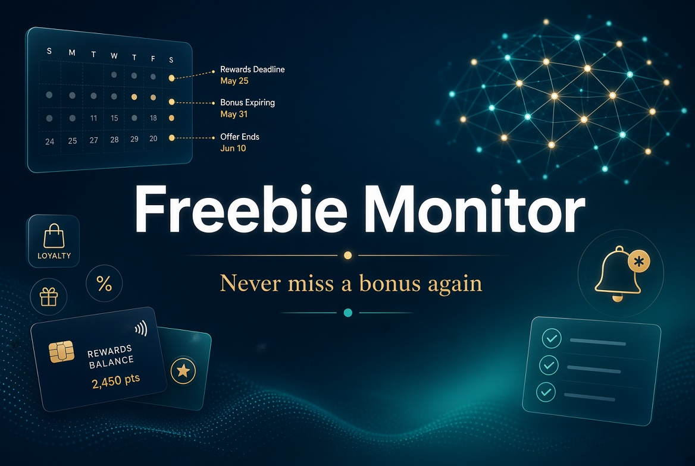

# Freebie Monitor

Built for **Battle of the Personal Brains** (Cognee + AWS Strands Agents + Docker Sandboxes +
Bright Data, Sept 21 2026). See [`story.md`](story.md) for the full writeup.

There's free money sitting out there — sign-up bonuses, cashback, bank bonuses — gated by real
rules: minimum deposits, maintenance windows, eligibility restrictions. Freebie Monitor finds
which offers actually fit your situation, remembers your progress, and tracks the real
deadlines. **It never signs up for anything on your behalf** — that's a hard rule enforced in
code, not a prompt, verified directly (see `agent/agent.py`'s `NeverSignUp` steering handler).

Two implementations live here:

## `agent/` — the required starting point, ported to this domain

A Python CLI agent built on [Strands Agents](https://strandsagents.com/) + [Cognee](https://docs.cognee.ai/),
matching the shape of the hackathon's required starter
([Agent-with-a-Brain](https://github.com/sandhya-subramani/Agent-with-a-Brain)): a
`MemoryManager`-backed `CogneeMemory` store, an `AuditHook` that logs every tool call, and a
`SteeringHandler` that blocks unsafe tool calls in code before they run — here retargeted from
retail-support policy to personal rewards tracking.

```bash
cd agent
python3 -m venv .venv && .venv/bin/pip install -r requirements.txt
cp .env.example .env   # fill in Cognee/Bright Data keys; model provider auto-detects
.venv/bin/python agent.py              # scripted demo questions
.venv/bin/python agent.py "question"   # ask one thing
.venv/bin/python agent.py --chat       # interactive
```

- **Cognee** — cloud API (`add_text`/`cognify`/`search`, still-supported "V1" verbs), not a
  local graph. Holds the person's profile and every tracked commitment as a real knowledge
  graph, injected into the agent's context each turn.
- **Strands Agents** — the agent loop, tools (`find_deals`, `start_tracking`,
  `report_progress`, `check_company_standing`, `apply_for_account`), the hook, the steering
  policy. Model provider auto-detects Bedrock when AWS credentials resolve, falling back to a
  local OpenAI-compatible endpoint otherwise (`STRANDS_PROVIDER` to force either).
- **Bright Data** — live deal discovery and a class-action/settlement check on the issuer
  before recommending it, both through a fetch-once/extract-many cache (`cache.py`): a page is
  scraped once, then a small focused extraction pass distills it, so re-asking the same
  question never re-scrapes or re-runs inference.
- **Docker** — considered for the tracking step and deliberately dropped: that step is
  calendar-and-reminder logic running a script we wrote ourselves, with no untrusted code and
  no real isolation need. Forcing Docker in would have been decoration, not function; see
  `story.md`'s Challenges section for the fuller reasoning.

Real bugs found and fixed along the way (all documented in `config.py`'s and `cache.py`'s
docstrings): Bedrock needs `streaming=False` for tool calls (its streaming path fragments them),
the local endpoint needs the *opposite* (its non-streaming path hits a different Strands SDK
bug), and small models can't be trusted to retype numbers through tool-call arguments at all —
fixed by reading dollar figures directly from the person's raw message in code, never through
a model-generated argument.

## `public/` + `src/` — the original web app

A polished Node/Hono/TypeScript web UI: onboarding, tiered deal cards (LEGENDARY/RARE/COMMON by
fit), a ticket timeline per tracked deal with self-reported progress bars, and a running score
total. Built first, before the required-starter constraint was known; kept as the more
demoable, visual surface.

```bash
npm install
cp .env.example .env
npm run dev
```

Opens on `http://localhost:3000` (`PORT` to override). Check `GET /api/status` for which
integrations are live vs. falling back — see inline comments in `src/integrations/` for the
same class of provider-specific bugs found and worked around as in `agent/`.

**Demo flow:** answer the six intake questions → land on personalized, tiered drops with
reasoning citing your specific answers → click **I'm doing this** → watch the tickets get built
and a real Docker sandbox log appear → switch to **To-Do** → check tickets off or report
deposit progress, with a nag banner if you're falling behind pace.
